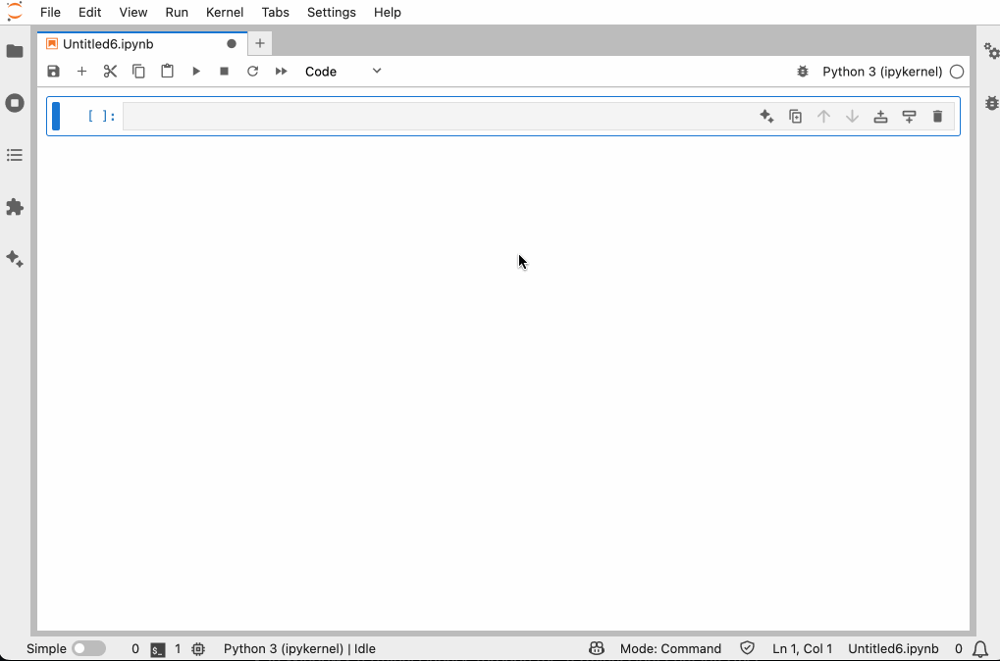
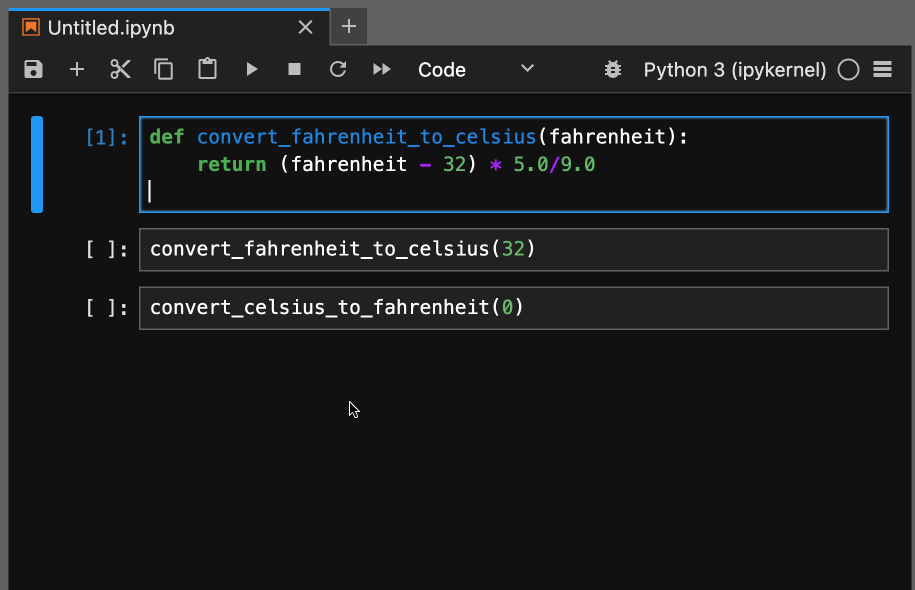
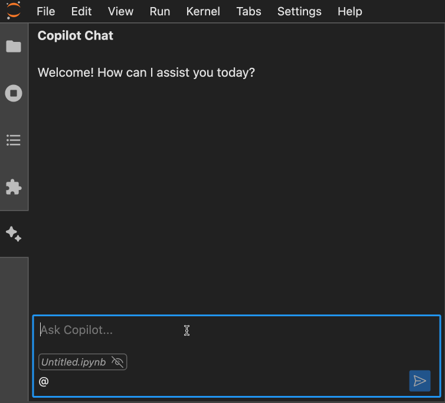
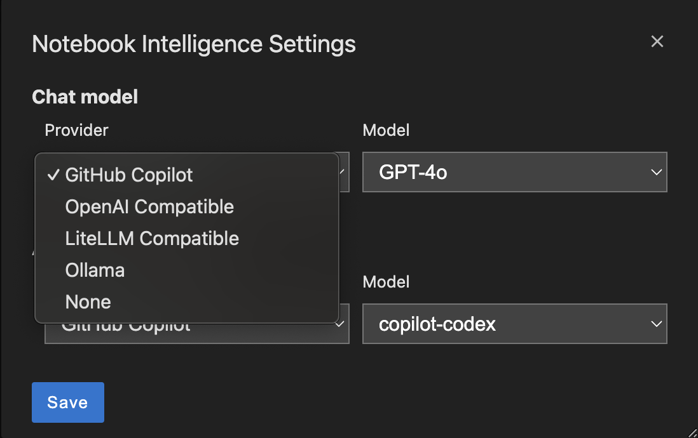
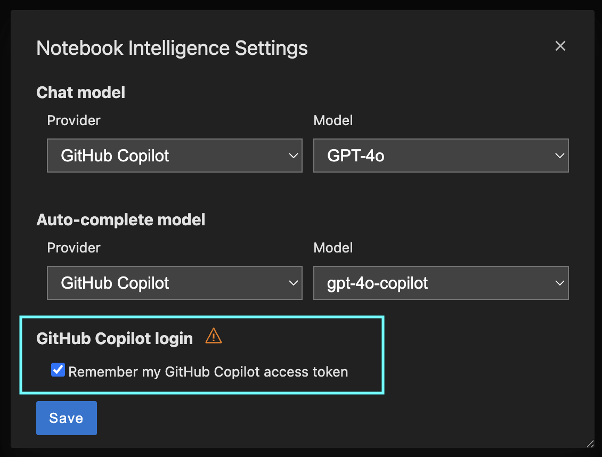
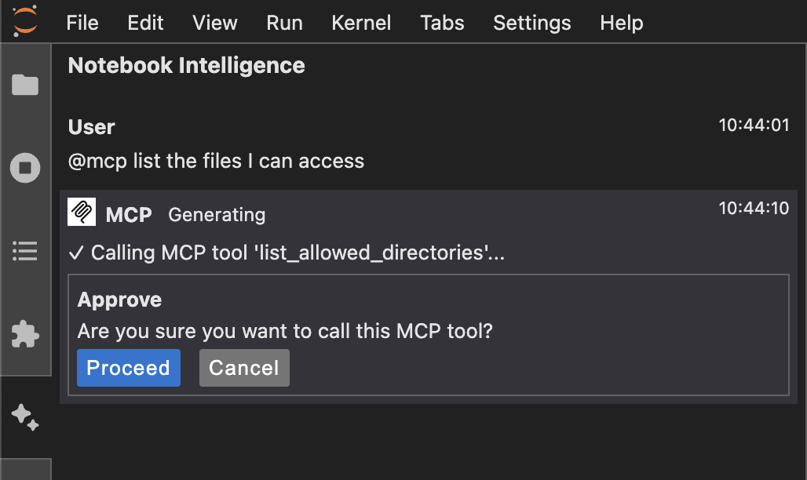

# Notebook Intelligence

Notebook Intelligence (NBI) is an AI coding assistant and extensible AI framework for JupyterLab. It can use GitHub Copilot or AI models from any other LLM Provider, including local models from [Ollama](https://ollama.com/). NBI greatly boosts the productivity of JupyterLab users with AI assistance.

See blog posts for features and usage.

- [Introducing Notebook Intelligence!](https://notebook-intelligence.github.io/notebook-intelligence/blog/2025/01/08/introducing-notebook-intelligence.html)
- [Building AI Extensions for JupyterLab](https://notebook-intelligence.github.io/notebook-intelligence/blog/2025/02/05/building-ai-extensions-for-jupyterlab.html)
- [Building AI Agents for JupyterLab](https://notebook-intelligence.github.io/notebook-intelligence/blog/2025/02/09/building-ai-agents-for-jupyterlab.html)
- [Notebook Intelligence now supports any LLM Provider and AI Model!](https://notebook-intelligence.github.io/notebook-intelligence/blog/2025/03/05/support-for-any-llm-provider.html)

### Code generation with inline chat

Use the sparkle icon on cell toolbar or the keyboard shortcuts to show the inline chat popover.

Keyboard shortcuts: `Ctrl + G` / `Cmd + G` is the shortcut to show the inline chat popover and `Ctrl + Enter` / `Cmd + Enter` is the shortcut to accept the suggestion. Clicking `Escape` key closes the popover.



### Auto-complete

Auto-complete suggestions are shown as you type. Clicking `Tab` key accepts the suggestion. NBI provides auto-complete suggestions in code cells and Python file editors.



### Chat interface



## Installation

NBI requires JupyterLab >= 4.0.0. To install the extension, run the command below and restart JupyterLab.

```bash
pip install notebook-intelligence
```

## Configuration options

### Configuring LLM Provider and models

You can configure the model provider and model options using the Notebook Intelligence Settings dialog. You can access this dialog from JupyterLab Settings menu -> Notebook Intelligence Settings, using `/settings` command in NBI Chat or by using the command palette. For more details, see the [blog post](https://notebook-intelligence.github.io/notebook-intelligence/blog/2025/03/05/support-for-any-llm-provider.html).



Notebook Intelligence extension for JupyterLab

This extension is composed of a Python package named `notebook_intelligence`
for the server extension and a NPM package named `@notebook-intelligence/notebook-intelligence`
for the frontend extension.

### Remembering GitHub Copilot login

Notebook Intelligence can remember your GitHub Copilot login so that you don't need to re-login after a JupyterLab or system restart. Please be aware of the security implications of using this feature.

> [!CAUTION]
> If you configure NBI to remember your GitHub Copilot login, it will encrypt the token and store into a data file at `~/.jupyter/nbi-data.json`. You should never share this file with others as they can access your tokens.
> Even though the token is encrypted, it is done so by using a default password and that's why it can be decrypted by others. In order to prevent that you can specify a custom password using the environment variable `NBI_GH_ACCESS_TOKEN_PASSWORD`.

```bash
NBI_GH_ACCESS_TOKEN_PASSWORD=my_custom_password
```

To let Notebook Intelligence remember your GitHub access token, go to Notebook Intelligence Settings dialog and check the option `Remember my GitHub Copilot access token` as shown below.



If your stored access token fails to login (due to expiration or other reasons), you will be prompted to relogin on the UI.

### Configuration files

NBI saves configuration at `~/.jupyter/nbi-config.json`. It also supports environment wide base configuration at `<env-prefix>/share/jupyter/nbi-config.json`. Organizations can ship default configuration at this environment wide config path. User's changes will be stored as overrides at `~/.jupyter/nbi-config.json`.

These config files are used for saving LLM provider, model and MCP configuration. Note that API keys you enter for your custom LLM providers will also be stored in these config files.

> [!IMPORTANT]
> Note that updating nbi-config.json manually requires restarting JupyterLab to take effect.

### Model Context Protocol ([MCP](https://modelcontextprotocol.io)) Support

NBI seamlessly integrates with MCP servers. It supports servers with both Standard Input/Output (stdio) and Server-Sent Events (SSE) transports. The MCP support is limited to server tools at the moment.

You can easily add MCP servers to NBI by editing the configuration file [nbi-config.json](#configuration-files). Simply add a key "mcp" and "mcpServers" under it as shown below.

> [!NOTE]
> Using MCP servers requires an LLM model with tool calling capabilities. All of the GitHub Copilot models provided in NBI support this feature. If you are using other providers make sure you choose a tool calling capable model.

> [!CAUTION]
> Note that most MCP servers are run on the same computer as your JupyterLab installation and they can make irreversible changes to your computer and/or access private data. Make sure that you only install MCP servers from trusted sources.

```json
{
    "chat_model": {
        ...
    },
    ...<other configuration>,

    "mcp": {
        "mcpServers": {
            "filesystem": {
                "command": "npx",
                "args": [
                    "-y",
                    "@modelcontextprotocol/server-filesystem",
                    "/Users/mbektas/mcp-test"
                ]
            },
        }
    }
}
```

This will automatically create a new chat participant in NBI and you can access it by starting your prompts with `@mcp`. Use `@mcp /info` prompt to get information on the tools provided by the MCP servers you configured. This chat participant will have access all the tools provided by the servers you configure.



By default, each tool call to MCP servers will require approval. If you would like to auto approve tools, you can do so by using the `"alwaysAllow": []` configuration key in the nbi-config.json. Simply list the names of tools.

```json
"mcpServers": {
    "filesystem": {
        "command": "npx",
        "args": [
            "-y",
            "@modelcontextprotocol/server-filesystem",
            "/Users/mbektas/mcp-test"
        ],
        "alwaysAllow": ["list_allowed_directories", "list_directory"]
    },
}
```

For servers with stdio transport, you can also set additional environment variables by using the `env` key. Environment variables are specified as key value pairs.

```json
"mcpServers": {
    "servername": {
        "command": "",
        "args": [],
        "env": {
            "ENV_VAR_NAME": "ENV_VAR_VALUE"
        }
    },
}
```

Below is an example of a server configuration with SSE transport. For SSE transport servers, you can also specify headers to be sent as part of the requests.

```json
"mcpServers": {
    "remoterservername": {
        "url": "http://127.0.0.1:8080/sse",
        "headers": {
            "Authorization": "Bearer mysecrettoken"
        }
    },
}
```

If you have multiple servers configured but you would like to disable some for a while, you can do so by using the `disabled` key. `servername2` will be disabled and not available in `@mcp` chat participant.

```json
"mcpServers": {
    "servername1": {
        "command": "",
        "args": [],
    },
    "servername2": {
        "command": "",
        "args": [],
        "disabled": true
    },
}
```

#### Grouping MCP servers

When you integrate multiple MCP servers to NBI, all of their tools will be available under the same chat participant `@mcp`. However, this may not be ideal in many situations. You may want to group certain servers and their tools based on their functionality. NBI lets you do that easily by configuring MCP chat participants. You can list the servers for each custom participant. If there are any unassigned MCP servers, then they will be used the default `@mcp` chat participant.

Below is an example of creating a custom MCP participant. This configuration results in two chat participants `@mcp-fs` with `filesytem` MC server tools and `@mcp` with `servername1` and `servername1` MCP server tools.

```json
{
    "chat_model": {
        ...
    },
    ...<other configuration>,

    "mcp": {
        "mcpServers": {
            "filesystem": {
                "command": "npx",
                "args": [
                    "-y",
                    "@modelcontextprotocol/server-filesystem",
                    "/Users/mbektas/mcp-test"
                ]
            },
            "servername1": {
                "command": "",
                "args": [],
            },
            "servername2": {
                "command": "",
                "args": [],
                "disabled": true
            }
        },
        "participants": {
            "fs": {
                "name": "MCP - File system",
                "servers": ["filesystem"]
            }
        }
    }
}
```

#### Using NBI tools within MCP chat participants

NBI allows you to access built-in tools from an MCP participant. You can do that by adding the list of built in NBI tools to your MCP participant configuration. The built-in tools available to MCP are `create_new_notebook`, `add_markdown_cell_to_notebook`, `add_code_cell_to_notebook`. Below is an example that integrates all these tools to MCP participant `@mcp-fs`.

```json
"participants": {
    "fs": {
        "name": "MCP - File system",
        "servers": ["filesystem"],
        "nbiTools": [
            "create_new_notebook",
            "add_markdown_cell_to_notebook",
            "add_code_cell_to_notebook"
        ]
    }
}
```

This chat participant will allow you to run example prompts like below.

```
@mcp-fs list the directories I have access to.
```

```
@mcp-fs add a code cell which demonstrates ipywidgets Button to this notebook.
```

### Developer documentation

For building locally and contributing see the [developer documentatation](CONTRIBUTING.md).
